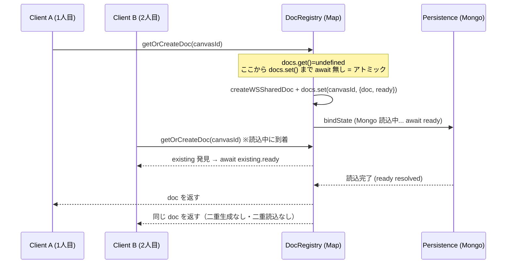
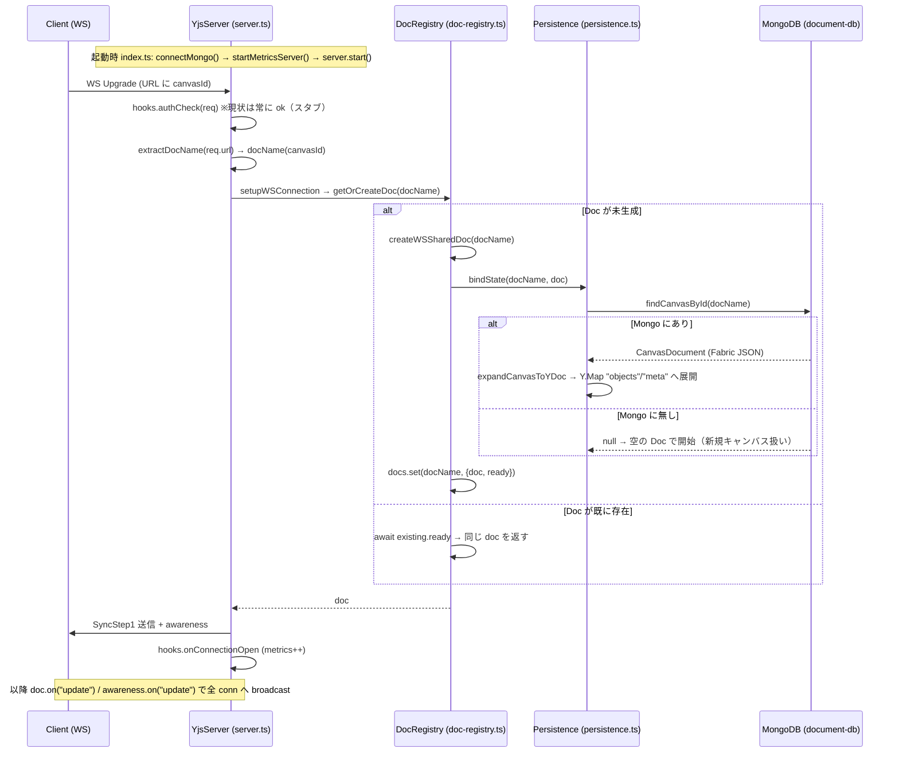
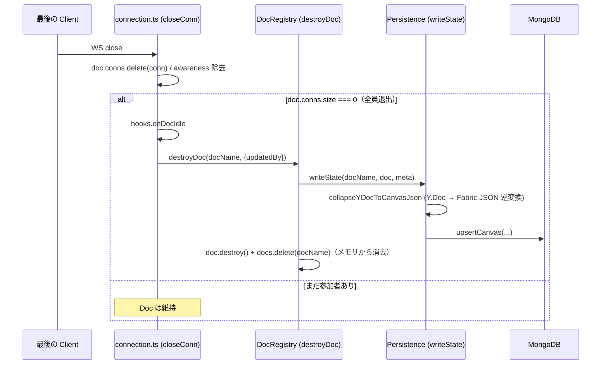

# Yjs Server ライフサイクル Q&A

> 対象: `apps/yjs-server` — Y.Doc のライフサイクル / 排他制御 / 永続化フロー
> 対象読者: 本プロジェクトの実装開発者・レビュアー
> 最終更新: 2026-07-14

---

## 目次

1. [結論（要点先出し）](#1-結論要点先出し)
2. [Q1. Doc はシングルトンで排他制御されているか？](#2-q1-doc-はシングルトンで排他制御されているか)
3. [Q2. 概要フロー（ライフサイクル）](#3-q2-概要フローライフサイクル)
4. [終了フロー（全員退出 → 永続化 → 破棄）](#4-終了フロー全員退出--永続化--破棄)
5. [補足論点（設計上の前提・注意点）](#5-補足論点設計上の前提注意点)
6. [参照ソースファイル一覧](#6-参照ソースファイル一覧)

---

## 1. 結論（要点先出し）

- **Q1: シングルトン排他制御 → YES。**
  `docName`（= canvasId）をキーにした `Map` で Y.Doc を1インスタンスだけ保持する。
  実装箇所は `doc-registry.ts` の `createDocRegistry()` 内 `getOrCreateDoc()`。
  同時接続による二重生成は **Promise ベースの排他制御（`ready` Promise）** で防止している。

- **Q2: 概要フロー →**
  `WS 接続確立 → docName（canvasId）抽出 → getOrCreateDoc → Mongo Select（findCanvasById）→ Fabric JSON を Y.Doc へ展開 / 無ければ空 Doc 生成 → SyncStep1 送信` の順で進む。

---

## 2. Q1. Doc はシングルトンで排他制御されているか？

### 2.1 どこでシングルトンを実現しているか

`apps/yjs-server/src/yjs/doc-registry.ts` が唯一の管理点。プロセス内で `Map` を1つ保持し、**キーが `docName`（canvasId）**。1つの canvasId に対し Y.Doc は必ず1インスタンスになる。

```ts
// apps/yjs-server/src/yjs/doc-registry.ts (L28-29)
const docs = new Map<string, { doc: WSSharedDoc; ready: Promise<void> }>();
let persistence: Persistence | null = null;
```

### 2.2 2人同時接続時の排他制御ロジック

核心は `getOrCreateDoc()`。

```ts
// apps/yjs-server/src/yjs/doc-registry.ts (L112-136)
async getOrCreateDoc(docName: string): Promise<WSSharedDoc> {
  const existing = docs.get(docName);
  if (existing) {
    await existing.ready;      // ② 2人目: 1人目の初期化完了を待って同じ doc を得る
    return existing.doc;
  }

  const doc = createWSSharedDoc(docName);
  const ready =
    persistence !== null
      ? persistence.bindState(docName, doc)  // Mongo 読込 Promise
      : Promise.resolve();

  docs.set(docName, { doc, ready });         // ① await より前に "同期的" に登録

  try {
    await ready;
  } catch (err) {
    docs.delete(docName);                    // 失敗時は自己修復（次回接続で再試行）
    doc.destroy();
    throw err;
  }

  return doc;
},
```

### 2.3 なぜ排他制御が成立するのか



排他制御が成立する2つの理由:

1. **Node.js のシングルスレッド（イベントループ）性**
   `docs.get()` が `undefined` を返してから `docs.set()` するまでの間に `await` が **一切無い**。この区間はアトミックに実行され、他の接続処理が割り込めない。

2. **`ready` Promise による「初期化中ロック」**
   1人目が `{ doc, ready }` を await より前に同期登録するため、初期化（`bindState` = Mongo 読込）中に到着した2人目は `existing` を必ず発見し、`await existing.ready` で完了を待つ。結果として **同一 `doc`** を受け取る。

→ Promise ベースのミューテックスとして機能し、「Mongo からの初期ロード中に2人目が来ても二重生成・二重読込しない」ことが保証される。

---

## 3. Q2. 概要フロー（ライフサイクル）

### 3.1 起動〜接続確立〜Doc生成のシーケンス



### 3.2 各フェーズと対応コード

#### ① 起動 — `apps/yjs-server/src/index.ts`

```ts
// index.ts (L7-22)
await connectMongo();
console.log("[yjs-server] MongoDB connected");

startMetricsServer(parseInt(process.env.METRICS_PORT ?? "9091", 10));

const server = new YjsServer({
  host: process.env.HOST ?? "0.0.0.0",
  port: parseInt(process.env.PORT ?? "1234", 10),
  persistence: createMongoPersistence(),
  hooks: createKd1Hooks(),
});

await server.start();
```

#### ② 接続確立 + docName（canvasId）抽出 — `apps/yjs-server/src/yjs/server.ts`

認証 → `handleUpgrade` → `connection` イベントで URL から canvasId を抽出する。

```ts
// server.ts (L70-77)
this.wss.on("connection", (conn: WebSocket, req) => {
  const docName = extractDocName(req.url);
  void setupWSConnection(conn, docName, {
    registry: this.registry,
    hooks,
    pingTimeout,
  });
});
```

```ts
// server.ts (L105-109)
function extractDocName(url: string | undefined): string {
  if (!url) return "default";
  const parts = url.slice(1).split("?");
  return decodeURIComponent(parts[0]) || "default";
}
```

#### ③ Mongo Select → Fabric JSON 取得 → Y.Doc 展開 — `apps/yjs-server/src/kd1/persistence.ts`

```ts
// persistence.ts (bindState / L171-185)
async bindState(docName: string, doc: WSSharedDoc): Promise<void> {
  const canvasDoc = await findCanvasById(docName);   // canvasId で主キー Select
  if (!canvasDoc) {
    console.log(
      `[kd1:persistence:bind] "${docName}" — not found in MongoDB, starting empty`,
    );
    return;                                           // 見つからなければ空 Doc で開始
  }
  expandCanvasToYDoc(canvasDoc, doc);                 // Fabric JSON → Y.Map へ展開
```

- 見つかれば `expandCanvasToYDoc()` が Fabric JSON を
  - `Y.Map("objects")`: 各オブジェクトを `{ fabricSnapshot }` として保持
  - `Y.Map("meta")`: canvasName / 背景画像 / サムネイル等
  に展開する。
- 見つからなければ **空 Doc で開始**（新規キャンバスとして扱う）。

#### ④ 接続後処理（メッセージバッファリング → 本処理） — `apps/yjs-server/src/yjs/connection.ts`

初期化完了前のメッセージを一旦バッファし、`getOrCreateDoc` 完了後に本ハンドラへ切替＆バッファ再生する（メッセージ損失防止）。

```ts
// connection.ts (L132-151)
let doc: WSSharedDoc;
try {
  doc = await registry.getOrCreateDoc(docName);
} catch (err) {
  console.error(`[yjs:init-error] doc="${docName}"`, err);
  conn.off("message", earlyMessageHandler);
  conn.close();
  return;
}

// ── 正式ハンドラに切り替え
conn.off("message", earlyMessageHandler);
conn.on("message", (raw: ArrayBuffer) => {
  const message = new Uint8Array(raw);
  const skip = hooks?.onMessage?.(docName, conn, message);
  if (skip === false) return;
  messageListener(conn, doc, message);
});

doc.conns.set(conn, new Set());
```

その後 `sendSyncStep1(conn, doc)` でサーバ→クライアントへ初期状態を送信し、
バッファに溜めていたクライアント側メッセージを `messageListener` で再生する（`connection.ts` L189-197）。

---

## 4. 終了フロー（全員退出 → 永続化 → 破棄）

「同時編集の終わり方」も本サーバの重要なライフサイクル特性。**永続化は毎編集ではなく、全員退出時のみ**行われる（オンデマンド方式）。



#### ⑤ 切断・アイドル化 — `apps/yjs-server/src/yjs/connection.ts`

最後の1人が抜けて `doc.conns.size === 0` になると `onDocIdle` → `destroyDoc` を発火。

```ts
// connection.ts (closeConn / L100-113)
if (doc.conns.size === 0) {
  void (async () => {
    try {
      await hooks?.onDocIdle?.(doc.name, doc);
      await registry.destroyDoc(
        doc.name,
        userId !== undefined ? { updatedBy: userId } : undefined,
      );
      console.log(`[yjs:doc-idle] doc="${doc.name}" destroyed`);
    } catch (err) {
      console.error(`[yjs:doc-idle-error] doc="${doc.name}"`, err);
    }
  })();
}
```

#### ⑥ 永続化（writeState）→ Map から削除 — `apps/yjs-server/src/yjs/doc-registry.ts`

```ts
// doc-registry.ts (destroyDoc / L160-172)
async destroyDoc(docName: string, meta?: PersistenceWriteMeta): Promise<void> {
  const entry = docs.get(docName);
  if (!entry) return;

  if (persistence !== null) {
    await persistence.writeState(docName, entry.doc, meta);  // Mongo へ保存
  }
  entry.doc.destroy();     // メモリ解放
  docs.delete(docName);    // Map から削除 → シングルトン管理から外れる
},
```

- `writeState` は Y.Doc を Fabric JSON へ逆変換（`collapseYDocToCanvasJson`）し、`upsertCanvas` で Mongo に保存。
- `updatedBy` は **awareness 由来 → DB 既存値 → `"yjs-server"`** の順でフォールバック（`persistence.ts` L193-204）。
- 保存後に `doc.destroy()` して Map から削除し、メモリ上から Doc が消える。

→ ライフサイクルは **「初回接続で生成（Mongoロード）→ 全員退出で保存＆破棄」** というオンデマンド方式。

---

## 5. 補足論点（設計上の前提・注意点）

> 以下は本設計を運用・拡張する際に確認・合意すべき論点（一部は推測を含む）。

| # | 論点 | 内容 |
| --- | --- | --- |
| 1 | **水平スケール時のシングルトン非保証** | 排他制御は「1プロセス内」でのみ有効。複数インスタンス起動時は同一 canvasId の Y.Doc が別々に生成され、シングルトンは保証されない。現状コードにインスタンス間調停（Redis pub/sub 等）は見当たらず、**単一プロセス運用が前提**と考えられる（推測）。 |
| 2 | **永続化タイミング** | 全員退出時のみ保存のため、プロセスクラッシュ時は未保存分がロスする可能性。定期スナップショットの要否を検討。 |
| 3 | **`extractDocName` の `"default"` フォールバック** | URL に canvasId が無い接続は全て同一 Doc `"default"` に集約される。意図的か要確認。 |
| 4 | **`authCheck` は現状スタブ** | 常に `{ ok: true }` を返す（`hooks.ts` L17-20）。Phase 2 で JWT / session 検証を実装予定。 |

---

## 6. 参照ソースファイル一覧

| ファイル | 役割 |
| --- | --- |
| `apps/yjs-server/src/index.ts` | エントリポイント（Mongo接続 → metrics → サーバ起動） |
| `apps/yjs-server/src/yjs/server.ts` | HTTP + WebSocket サーバ、認証、docName 抽出 |
| `apps/yjs-server/src/yjs/doc-registry.ts` | **Y.Doc シングルトン管理・排他制御** |
| `apps/yjs-server/src/yjs/connection.ts` | WS 接続ハンドリング、Sync/Awareness、Ping/Pong、切断処理 |
| `apps/yjs-server/src/kd1/persistence.ts` | Mongo ⇔ Y.Doc 相互変換（bindState / writeState） |
| `apps/yjs-server/src/kd1/hooks.ts` | KD1 固有ライフサイクルフック（認証・ログ・メトリクス） |
| `apps/yjs-server/src/yjs/types.ts` | 型定義（WSSharedDoc / Persistence / DocRegistry 等） |
| `apps/yjs-server/src/yjs/metrics.ts` | Prometheus メトリクス |
