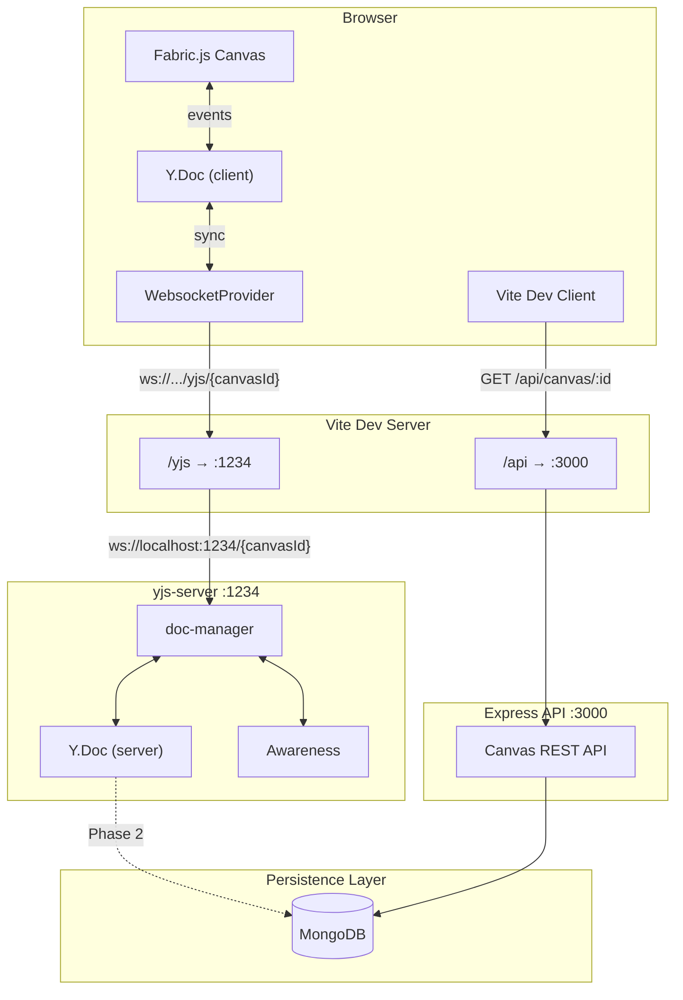
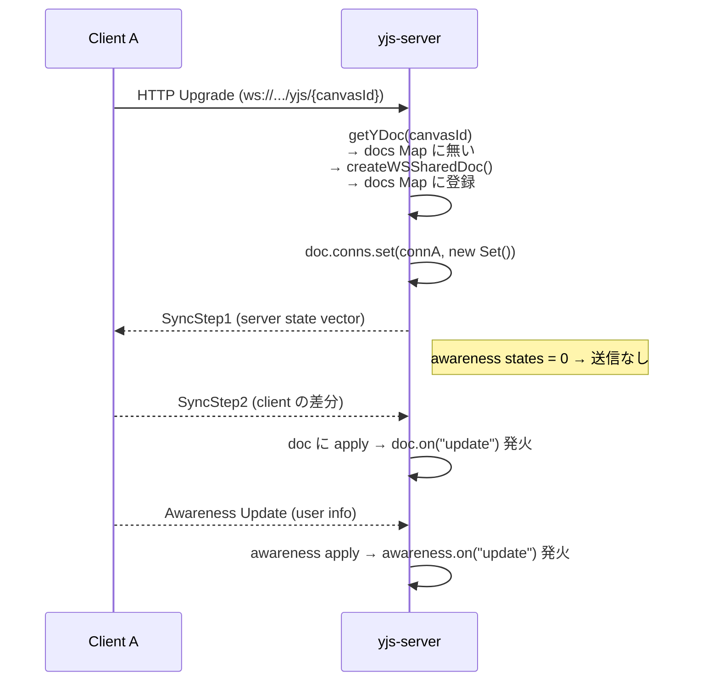
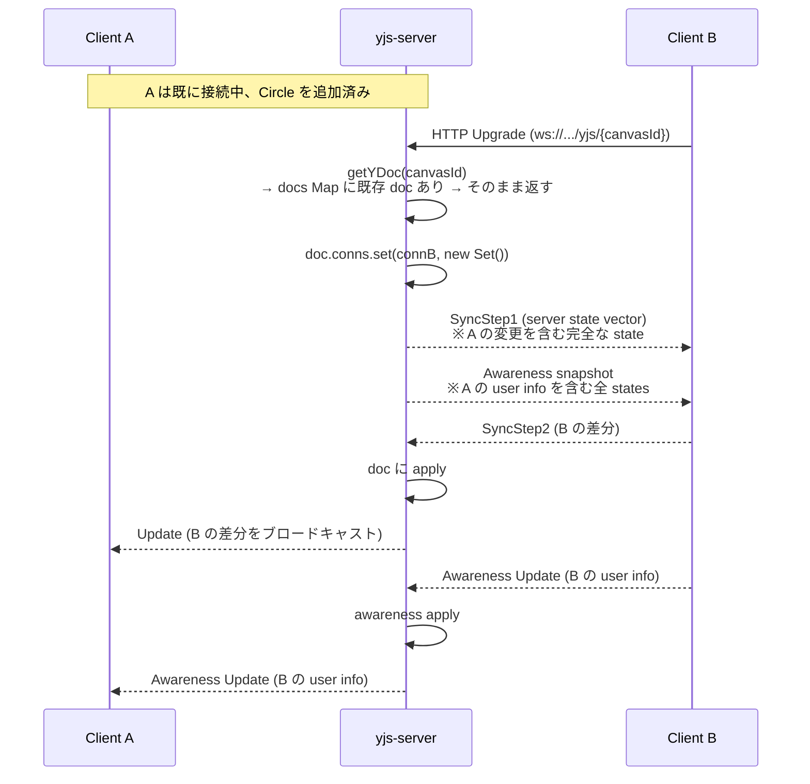
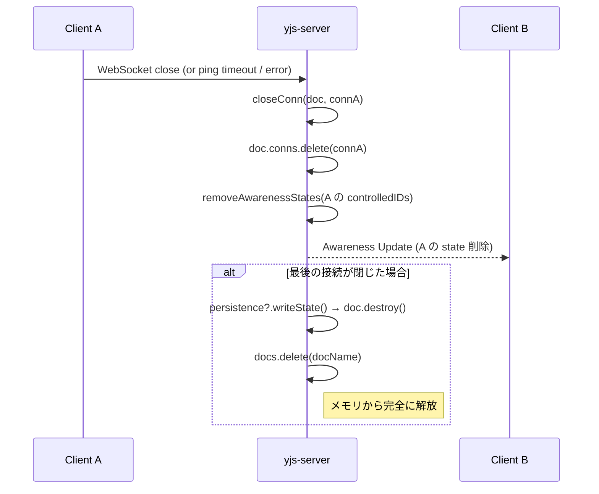
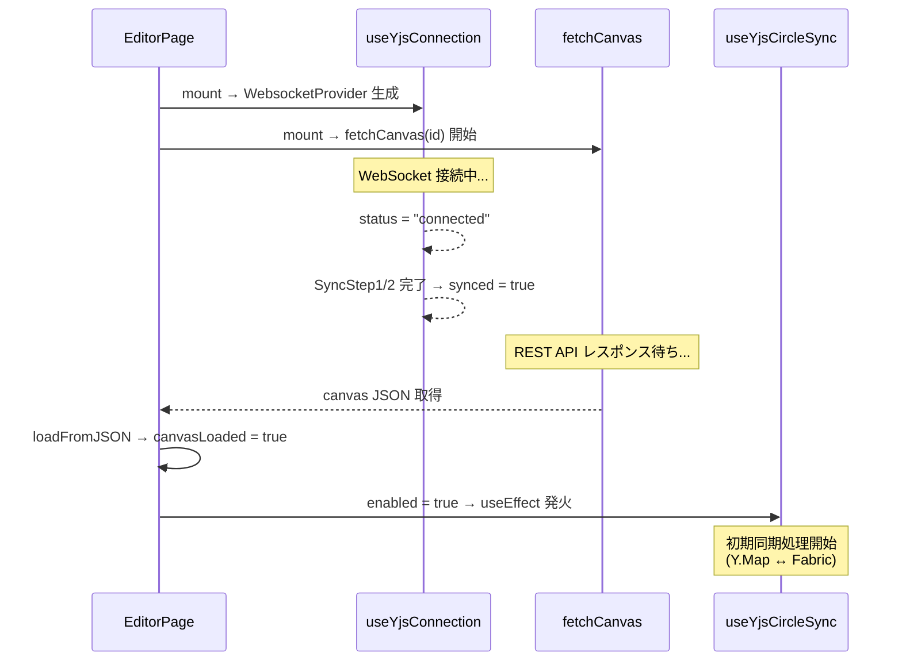
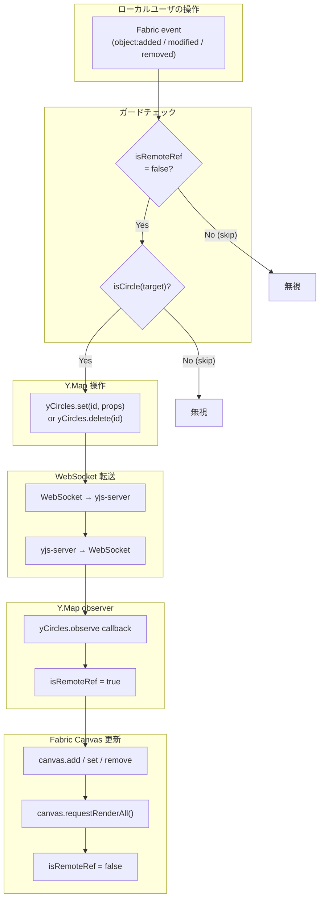

# Yjs 共同編集 アーキテクチャ設計書

> 対象: KD1 Canvas アプリケーション — Yjs CRDT リアルタイム共同編集基盤  
> 対象読者: 本プロジェクトの実装開発者  
> 最終更新: 2026-03-12 (Phase 1 — Circle 同期)

---

## 目次

1. [概要とシステム構成](#1-概要とシステム構成)
2. [用語集](#2-用語集)
3. [サーバサイド: WebSocket 接続とプロトコル](#3-サーバサイド-websocket-接続とプロトコル)
4. [クライアントサイド: 接続とライフサイクル](#4-クライアントサイド-接続とライフサイクル)
5. [Fabric.js と Y.Doc の双方向バインディング#](#5-fabricjs-と-ydoc-の双方向バインディング)
6. [オブジェクト同期ルール（実装者向けガイド）](#6-オブジェクト同期ルール実装者向けガイド)
7. [Awareness の利用](#7-awareness-の利用)
8. [既知の制約と Phase 2 への課題](#8-既知の制約と-phase-2-への課題)

---

## 1. 概要とシステム構成

### システム全体図




### 通信経路


| 経路                                       | プロトコル     | 用途                   |
| ---------------------------------------- | --------- | -------------------- |
| Browser → `/yjs/{canvasId}` → yjs-server | WebSocket | Y.Doc 同期 + Awareness |
| Browser → `/api/canvas/:id` → Express    | HTTP REST | Canvas JSON の初期ロード   |


### パッケージ依存


| レイヤー   | パッケージ         | バージョン    |
| ------ | ------------- | -------- |
| Client | `yjs`         | ^13.6.29 |
| Client | `y-websocket` | ^3.0.0   |
| Server | `yjs`         | ^13.6.24 |
| Server | `y-protocols` | ^1.0.6   |
| Server | `lib0`        | ^0.2.102 |
| Server | `ws`          | ^8.18.0  |


---

## 2. 用語集


| 用語                    | 説明                                                                      |
| --------------------- | ----------------------------------------------------------------------- |
| **Y.Doc**             | Yjs の CRDT ドキュメント。全ての共有データ型のルートコンテナ。各 Canvas (room) に 1 つ存在する           |
| **Y.Map**             | Y.Doc 内のキーバリュー型共有データ構造。オブジェクトタイプごとに独立した Map を使用（例: `"circles"`）         |
| **Awareness**         | ユーザのプレゼンス情報（カーソル位置、ユーザ名等）を管理する Y.Doc とは独立した仕組み。永続化されない                  |
| **SyncStep1**         | 同期プロトコルの第 1 ステップ。自身の state vector（各クライアントの最終クロック値）を相手に送信する              |
| **SyncStep2**         | 同期プロトコルの第 2 ステップ。受信した state vector を元に、相手が持っていない差分 update を送信する         |
| **Update**            | Y.Doc への変更をバイナリエンコードしたもの。SyncStep2 と同じフォーマットでリアルタイム変更にも使われる             |
| **WebsocketProvider** | `y-websocket` パッケージが提供するクライアント側の接続管理クラス。Y.Doc と WebSocket を橋渡しする        |
| **CRDT**              | Conflict-free Replicated Data Type。サーバを介さずに複数クライアント間でデータを矛盾なく統合できるデータ構造 |
| **lib0**              | Yjs エコシステムの低レベルユーティリティ。バイナリ encoding/decoding を提供する                     |
| **Room**              | 1 つの Canvas に対応する Y.Doc の論理的な部屋。URL パスの canvasId が room 名になる            |
| **controlledIDs**     | サーバ側で各 WebSocket 接続が「所有する」awareness client ID の Set。切断時の一括削除に使用         |


---

## 3. サーバサイド: WebSocket 接続とプロトコル

### 3.1 ファイル構成


| ファイル                                 | 役割                                  |
| ------------------------------------ | ----------------------------------- |
| `apps/yjs-server/src/index.ts`       | HTTP/WebSocket サーバ起動、upgrade ハンドリング |
| `apps/yjs-server/src/doc-manager.ts` | Y.Doc シングルトン管理、同期プロトコル、接続ライフサイクル    |
| `apps/yjs-server/src/types.ts`       | 型定義 (`WSSharedDoc`, `Persistence`)  |


### 3.2 型定義

```typescript
// apps/yjs-server/src/types.ts
export interface WSSharedDoc extends Doc {
  name: string;                              // room 名 (= canvasId)
  conns: Map<WebSocket, Set<number>>;        // 接続 → awareness client IDs
  awareness: Awareness;                      // プレゼンス管理
}

export interface Persistence {
  bindState: (docName: string, doc: WSSharedDoc) => Promise<void>;  // DB → Doc 復元
  writeState: (docName: string, doc: WSSharedDoc) => Promise<void>; // Doc → DB 永続化
}
```

### 3.3 HTTP Upgrade → WebSocket 確立

```typescript
// apps/yjs-server/src/index.ts L24-39
const wss = new WebSocketServer({ noServer: true });

server.on("upgrade", (request, socket, head) => {
  // TODO: Phase 2 で認証チェックを追加
  // const session = parseCookie(request.headers.cookie);
  // if (!session) { socket.destroy(); return; }

  wss.handleUpgrade(request, socket, head, (ws: WebSocket) => {
    wss.emit("connection", ws, request);
  });
});

wss.on("connection", (conn: WebSocket, req) => {
  setupWSConnection(conn, req);
});
```

`noServer: true` により HTTP Upgrade を自前で制御する。コメントアウトされた認証チェックが Phase 2 での挿入ポイントとなる。

### 3.4 メッセージタイプとルーティング

```typescript
// apps/yjs-server/src/doc-manager.ts L16-17
const MESSAGE_SYNC = 0;
const MESSAGE_AWARENESS = 1;
```

全メッセージは先頭 1 バイトでタイプを識別する:


| 値   | 定数                  | 内容                                        |
| --- | ------------------- | ----------------------------------------- |
| 0   | `MESSAGE_SYNC`      | ドキュメント同期 (SyncStep1 / SyncStep2 / Update) |
| 1   | `MESSAGE_AWARENESS` | プレゼンス情報                                   |


`messageListener` がメッセージを受信し、タイプに応じてルーティングする:

```typescript
// apps/yjs-server/src/doc-manager.ts L142-171
function messageListener(conn: WebSocket, doc: WSSharedDoc, message: Uint8Array): void {
  try {
    const encoder = encoding.createEncoder();
    const decoder = decoding.createDecoder(message);#
    const messageType = decoding.readVarUint(decoder);

    switch (messageType) {
      case MESSAGE_SYNC:
        encoding.writeVarUint(encoder, MESSAGE_SYNC);
        syncProtocol.readSyncMessage(decoder, encoder, doc, conn);
        // SyncStep1 受信時のみ応答 (SyncStep2) が encoder に書き込まれる
        if (encoding.length(encoder) > 1) {
          send(doc, conn, encoding.toUint8Array(encoder));
        }
        break;
      case MESSAGE_AWARENESS:
        awarenessProtocol.applyAwarenessUpdate(
          doc.awareness,
          decoding.readVarUint8Array(decoder),
          conn
        );
        break;
    }
  } catch (err) {
    console.error(err);
  }
}
```

`syncProtocol.readSyncMessage` は内部で SyncStep1 / SyncStep2 / Update を自動判別する。SyncStep1 を受信した場合のみ SyncStep2 を応答として encoder に書き込む（`length > 1` チェック）。

### 3.5 Y.Doc シングルトン管理

```typescript
// apps/yjs-server/src/doc-manager.ts L25 (docs Map), L80-92 (getYDoc)
const docs = new Map<string, WSSharedDoc>();

function getYDoc(docName: string): WSSharedDoc {
  const existing = docs.get(docName);
  if (existing) return existing;

  const doc = createWSSharedDoc(docName);
  docs.set(docName, doc);

  if (persistence !== null) {
    persistence.bindState(docName, doc);  // DB から復元
  }
  return doc;
}
```

`docs` Map がグローバルシングルトンとして全 room の Y.Doc を保持する。同じ canvasId に対する接続は同一の Y.Doc インスタンスを共有する。`getYDoc` と `docs` の間には `createWSSharedDoc`, `send`, `closeConn` 等の関#数が定義されている。

### 3.6 ブロードキャスト機構

`createWSSharedDoc` 内で 2 つのイベントリスナーを登録する:

**1. Y.Doc update → 全クライアントにブロードキャスト**

```typescript
// apps/yjs-server/src/doc-manager.ts L67-74
doc.on("update", (update: Uint8Array, _origin: unknown) => {
  const encoder = encoding.createEncoder();
  encoding.writeVarUint(encoder, MESSAGE_SYNC);
  syncProtocol.writeUpdate(encoder, update);
  const message = encoding.toUint8Array(encoder);
  doc.conns.forEach((_ids, conn) => send(doc, conn, message));
});
```

**2. Awareness update → 全クライアントにブロードキャスト**

```typescript
// apps/yjs-server/src/doc-manager.ts L44-65
doc.awareness.on("update",
  ({ added, updated, removed }, conn: WebSocket | null) => {
    const changedClients = added.concat(updated, removed);
    if (conn !== null) {
      const controlledIDs = doc.conns.get(conn);
      if (controlledIDs !== undefined) {
        added.forEach((id) => controlledIDs.add(id));
        removed.forEach((id) => controlledIDs.delete(id));
      }
    }
    const encoder = encoding.createEncoder();
    encoding.writeVarUint(encoder, MESSAGE_AWARENESS);
    encoding.writeVarUint8Array(encoder,
      awarenessProtocol.encodeAwarenessUpdate(doc.awareness, changedClients)
    );
    const message = encoding.toUint8Array(encoder);
    doc.conns.forEach((_ids, c) => send(doc, c, message));
  }
);
```

ブロードキャストは送信元を含む全接続に送信される。Yjs の update 適用は冪等なので、送信元が自身の update を受信しても問題ない。

### 3.7 シーケンス図

#### 新規接続（最初のユーザ A）#




#### 途中参加（ユーザ B が後から参加）




#### 離脱処理




### 3.8 Ping/Pong ヘルスチェック

```typescript
// apps/yjs-server/src/doc-manager.ts L195-212
let pongReceived = true;
const pingInterval = setInterval(() => {
  if (!pongReceived) {
    if (doc.conns.has(conn)) closeConn(doc, conn);
    clearInterval(pingInterval);
  } else if (doc.conns.has(conn)) {
    pongReceived = false;
    try { conn.ping(); } catch { closeConn(doc, conn); clearInterval(pingInterval); }
  }
}, PING_TIMEOUT);  // 30秒
```

30 秒間隔で `conn.ping()` を送信し、次の ping までに `pong` が返らなければ dead connection と判断して `closeConn()` を呼ぶ。

---

## 4. クライアントサイド: 接続とライフサイクル

### 4.1 ファイル構成


| ファイル                                               | 役割                                |
| -------------------------------------------------- | --------------------------------- |
| `features/canvas-yjs/hooks/useYjsConnection.ts`    | WebSocket 接続管理 + Awareness セットアップ |
| `features/canvas-yjs/hooks/useYjsCircleSync.ts`    | Fabric.js ↔ Y.Map 双方向バインディング#     |
| `features/canvas-yjs/ui/ConnectedUsers.tsx`        | Awareness → 接続ユーザ表示               |
| `features/canvas-yjs/ui/ConnectionStatusBadge.tsx` | 接続状態バッジ                           |
| `pages/example/canvas-yjs-editor.tsx`              | エディタページ（hooks の組み立て役）             |


### 4.2 Vite WebSocket プロキシ

```typescript
// apps/client/vite.config.ts L19-23
'/yjs': {
  target: 'ws://localhost:1234',
  ws: true,
  rewrite: (path) => path.replace(/^\/yjs/, ''),
},
```

ブラウザからの `ws://localhost:5173/yjs/{canvasId}` を `ws://localhost:1234/{canvasId}` に転送する。`/yjs` プレフィックスは除去される。

### 4.3 useYjsConnection — 接続管理 hook

```typescript
// features/canvas-yjs/hooks/useYjsConnection.ts
export function useYjsConnection(
  canvasId: string | undefined,
  user: User | null,
): YjsConnectionResult {
  const yDocRef = useRef<Y.Doc>(new Y.Doc());  // ① コンポーネント寿命で単一インスタンス
  // ...

  useEffect(() => {
    if (!canvasId) return;
    const doc = yDocRef.current;
    const wsProvider = new WebsocketProvider(buildWsUrl(), canvasId, doc, {
      connect: true,                             // ② 即座に接続開始
    });

    wsProvider.on("status", handleStatus);       // ③ connected / connecting / disconnected
    wsProvider.on("sync", handleSync);           // ④ SyncStep 完了で true
    setProvider(wsProvider);

    return () => {
      wsProvider.off("status", handleStatus);    // ⑤ クリーンアップ
      wsProvider.off("sync", handleSync);
      wsProvider.destroy();
      setProvider(null);
      setConnectionStatus("disconnected");
      setSynced(false);
    };
  }, [canvasId]);

  useEffect(() => {
    if (!provider || !user) return;
    provider.awareness.setLocalStateField("user", {  // ⑥ Awareness にユーザ情報セット
      userId: user.userId,
      name: user.screenName,
      avatarUrl: user.avatarUrl,###
      avatarColor: user.avatarColor,
    });
  }, [provider, user]);

  return { yDoc: yDocRef.current, provider, connectionStatus, synced };
}
```

**設計ポイント:**

- `Y.Doc` は `useRef` で保持し、再レンダリングで再生成されない
- `canvasId` が変わった場合のみ `WebsocketProvider` を再生成する
- `buildWsUrl()` は `location.protocol` と `location.host` から動的に WebSocket URL を構築する

### 4.4 エディタページのライフサイクル

```typescript
// pages/example/canvas-yjs-editor.tsx L37-40
const { user } = useCurrentUser();
const { yDoc, provider, connectionStatus, synced } = useYjsConnection(id, user);

useYjsCircleSync(yDoc, fabricRef, canvasLoaded);  // ← canvasLoaded のみで制御
```

```typescript
// pages/example/canvas-yjs-editor.tsx L42-65（エラーハンドリング等は簡略化）
useEffect(() => {
  if (!id) return;
  const ac = new AbortController();

  (async () => {
    setIsLoading(true);
    try {
      const data = await fetchCanvas(id, ac.signal);
      if (ac.signal.aborted) return;
      setCanvasName(data.canvasName);
      await fabricRef.current?.loadFromJSON(data.canvas);  // Fabric Canvas に描画
      setCanvasLoaded(true);                                // ← ここで同期が有効化される
    } catch (e) {
      if (ac.signal.aborted || axios.isCancel(e)) return;
      setServerError(e instanceof Error ? e.message : "Failed to load canvas.");
    } finally {
      if (!ac.signal.aborted) setIsLoading(false);
    }
  })();

  return () => ac.abort();
}, [id]);
```

### 4.5 タイミング図: WebSocket sync と REST fetch の並行実行




`**canvasLoaded` のみで `enabled` を制御する理由:**

`synced` を条件に含めると、SyncStep2 完了後に observe を登録することになり、SyncStep2 で Y.Map に入った `add` イベントを取りこぼす。`canvasLoaded` 時点で observe を登録しておけば、SyncStep2 が後から来ても observer の `case "add"` で自動的に反映される。

---

## 5. Fabric.js と Y.Doc の双方向バインディング

### 5.1 全体データフロー




### 5.2 ID 管理: WeakMap による紐付け

```typescript
// features/canvas-yjs/hooks/useYjsCircleSync.ts L44-56
const yjsIdMap = new WeakMap<FabricObject, string>();

function getCircleId(obj: FabricObject): string {
  let id = yjsIdMap.get(obj);
  if (!id) {
    id = crypto.randomUUID();
    yjsIdMap.set(obj, id);
  }
  return id;
}

function setCircleId(obj: FabricObject, id: string): void {
  yjsIdMap.set(obj, id);
}
```

**設計判断:** Fabric オブジェクト自体のプロパティ（`obj.data` 等）に ID を持たせず、外部の `WeakMap` で管理する。理由:

- Fabric v7 の型定義に `data` プロパティが存在しない
- Fabric オブジェクトの内部状態を汚さない
- `WeakMap` なので Fabric オブジェクトが GC されればエントリも自動消滅

### 5.3 Fabric → Y.Map 方向（ローカル操作の伝播）

3 つの Fabric イベントをリッスンし、対応する Y.Map 操作を行う:

```typescript
// features/canvas-yjs/hooks/useYjsCircleSync.ts L82-102

// ドラッグ/リサイズ/回転完了時
const handleObjectModified = (e: { target?: FabricObject }) => {
  if (isRemoteRef.current || !e.target || !isCircle(e.target)) return;
  const id = getCircleId(e.target);
  yCircles.set(id, fabricToYjs(e.target));
};

// Canvas に新オブジェクト追加時
const handleObjectAdded = (e: { target?: FabricObject }) => {
  if (isRemoteRef.current || !e.target || !isCircle(e.target)) return;
  const id = getCircleId(e.target);
  if (!yCircles.has(id)) {
    yCircles.set(id, fabricToYjs(e.target));
  }
};

// Canvas からオブジェクト削除時
const handleObjectRemoved = (e: { target?: FabricObject }) => {
  if (isRemoteRef.current || !e.target || !isCircle(e.target)) return;
  const id = getCircleId(e.target);
  if (yCircles.has(id)) {
    yCircles.delete(id);
  }
};
```

全ハンドラに共通するガード条件:

1. `isRemoteRef.current === true` → スキップ（リモート操作の反映中）
2. `e.target` が存在し `isCircle()` であること

### 5.4 Y.Map → Fabric 方向（リモート操作の反映）

```typescript
// features/canvas-yjs/hooks/useYjsCircleSync.ts L104-142
const observer = (event: Y.YMapEvent<CircleProps>) => {
  isRemoteRef.current = true;   // ← ガード ON
  try {
    event.keys.forEach((change, key) => {
      switch (change.action) {
        case "add": {
          const props = yCircles.get(key);
          if (!props) break;
          if (findFabricCircleById(canvas, key)) break;  // 重複チェック
          const circle = new Circle(props);
          setCircleId(circle, key);   // WeakMap に ID を登録
          canvas.add(circle);
          break;
        }
        case "update": {
          const props = yCircles.get(key);
          if (!props) break;
          const existing = findFabricCircleById(canvas, key);
          if (!existing) break;
          existing.set(
            Object.fromEntries(CIRCLE_KEYS.map((k) => [k, props[k]])),
          );
          existing.setCoords();       // バウンディングボックス再計算
          break;
        }
        case "delete": {
          const existing = findFabricCircleById(canvas, key);
          if (existing) canvas.remove(existing);
          break;
        }
      }
    });
    canvas.requestRenderAll();        // 一括再描画
  } finally {
    isRemoteRef.current = false;      // ← ガード OFF
  }
};
```

### 5.5 isRemoteRef ガード機構（無限ループ防止）

双方向バインディングの最重要メカニズム。以下のフローで無限ループを断ち切る:

```
[ユーザ A がローカルで Circle を追加]
  Fabric "object:added" 発火
    → isRemoteRef = false → yCircles.set() 実行
      → WebSocket でサーバに送信 → 全クライアントにブロードキャスト

[ユーザ B で受信]
  Y.Map observer 発火
    → isRemoteRef = true にセット
      → canvas.add(circle) 実行
        → Fabric "object:added" 発火
          → isRemoteRef = true なのでスキップ  ← ここで無限ループを断ち切る
    → finally で isRemoteRef = false に戻す
```

`useRef(false)` で管理しているため React の再レンダリングを引き起こさず、同期的に読み書きできる。

### 5.6 初期同期処理

`enabled = true` になった時点で、Y.Map と Fabric Canvas の状態を整合させる:

```typescript
// features/canvas-yjs/hooks/useYjsCircleSync.ts L149-155

// Y.Map にデータがあれば Canvas に描画（途中参加で SyncStep2 が先に完了した場合）
if (yCircles.size > 0) {
  renderYjsCirclesToCanvas(canvas, yCircles, isRemoteRef);
}
// Canvas 上の Circle を Y.Map に登録（最初のユーザ or SyncStep2 がまだの場合）
syncExistingCirclesToYjs(canvas, yCircles);
```

**3 つのシナリオ:**


| シナリオ                    | Y.Map | Fabric Canvas        | 動作                                                                                  |
| ----------------------- | ----- | -------------------- | ----------------------------------------------------------------------------------- |
| A: 最初のユーザ               | 空     | MongoDB から Circle あり | `syncExistingCirclesToYjs` で Fabric → Y.Map                                         |
| B: 途中参加 (SyncStep2 完了済) | データあり | MongoDB から Circle あり | `renderYjsCirclesToCanvas` で Y.Map → Fabric、`syncExistingCirclesToYjs` は重複チェックでスキップ |
| C: 途中参加 (SyncStep2 未完了) | 空     | MongoDB から Circle あり | 両方とも実質 no-op、後から SyncStep2 が来たら observer の `"add"` で反映                              |


`**renderYjsCirclesToCanvas` — Y.Map → Fabric:**

```typescript
// features/canvas-yjs/hooks/useYjsCircleSync.ts L181-198
function renderYjsCirclesToCanvas(
  canvas: Canvas,
  yCircles: Y.Map<CircleProps>,
  isRemoteRef: React.RefObject<boolean>,
): void {
  isRemoteRef.current = true;   // ← object:added の二重登録を防止
  try {
    yCircles.forEach((props, key) => {
      if (findFabricCircleById(canvas, key)) return;
      const circle = new Circle(props);
      setCircleId(circle, key);
      canvas.add(circle);
    });
    canvas.requestRenderAll();
  } finally {
    isRemoteRef.current = false;
  }
}
```

`**syncExistingCirclesToYjs` — Fabric → Y.Map:**

```typescript
// features/canvas-yjs/hooks/useYjsCircleSync.ts L204-215
function syncExistingCirclesToYjs(
  canvas: Canvas,
  yCircles: Y.Map<CircleProps>,
): void {
  const circles = canvas.getObjects().filter(isCircle);
  for (const circle of circles) {
    const id = getCircleId(circle);
    if (!yCircles.has(id)) {      // 重複チェック
      yCircles.set(id, fabricToYjs(circle));
    }
  }
}
```

- a
  - b
- c

---

## 6. オブジェクト同期ルール（実装者向けガイド）

Phase 1 では Circle のみを同期対象としている。今後 Rect, Path, Text 等を追加する際は、以下のルールに従う。

### 6.1 Y.Map 命名規則

オブジェクトタイプごとに独立した Y.Map を使用する:

```typescript
const yCircles = yDoc.getMap<CircleProps>("circles");
const yRects   = yDoc.getMap<RectProps>("rects");       // 将来追加
const yPaths   = yDoc.getMap<PathProps>("paths");       // 将来追加
```

1 つの Y.Map に全タイプを混在させない。理由:

- observer のイベントハンドリングが複雑化する
- タイプごとに独立して拡張・テストできる

### 6.2 Props 型定義

同期対象のプロパティを `interface XxxProps` で明示的に定義する。Fabric オブジェクトの全プロパティではなく、同期に必要な最小限のみを選定する:

```typescript
// Circle の例
interface CircleProps {
  left: number;
  top: number;
  radius: number;
  fill: string;
  stroke: string;
  strokeWidth: number;
  scaleX: number;
  scaleY: number;
  angle: number;
}

const CIRCLE_KEYS: (keyof CircleProps)[] = [
  "left", "top", "radius", "fill", "stroke",
  "strokeWidth", "scaleX", "scaleY", "angle",
];
```

`CIRCLE_KEYS` 配列は `update` アクション時のプロパティ一括更新に使用する。

### 6.3 必須関数セット

新しいオブジェクトタイプを追加する際、以下の関数を必ず定義する:


| 関数                              | 役割                       | 例                       |
| ------------------------------- | ------------------------ | ----------------------- |
| `isXxx(obj): obj is Xxx`        | 型判別（type guard）          | `obj.type === "circle"` |
| `fabricToYjs(obj): XxxProps`    | Fabric → Y.Map 変換        | プロパティ抽出                 |
| `getXxxId(obj): string`         | WeakMap から ID 取得（なければ生成） | `crypto.randomUUID()`   |
| `setXxxId(obj, id): void`       | WeakMap に ID 登録          | リモート受信時に使用              |
| `findFabricXxxById(canvas, id)` | Canvas 上から ID で検索        | observer 内で使用           |


### 6.4 ID 管理ルール

- **ID は `WeakMap<FabricObject, string>` で管理する**。Fabric オブジェクトのプロパティには書き込まない
- **ローカルで生成したオブジェクト**: `getXxxId()` が `crypto.randomUUID()` で新規 ID を発行
- **リモートから受信したオブジェクト**: observer の `"add"` 内で `setXxxId(circle, key)` により Y.Map のキーを ID として登録
- **ID の一意性**: Y.Map のキーとして使用されるため、room 内で一意であることが保証される

### 6.5 イベントハンドリングルール

#### Fabric → Y.Map（ローカル操作）

3 つのイベントを必ずハンドルする:


| Fabric イベント       | Y.Map 操作              | ガード                                       |
| ----------------- | --------------------- | ----------------------------------------- |
| `object:added`    | `yMap.set(id, props)` | `isRemoteRef` + `isXxx` + `!yMap.has(id)` |
| `object:modified` | `yMap.set(id, props)` | `isRemoteRef` + `isXxx`                   |
| `object:removed`  | `yMap.delete(id)`     | `isRemoteRef` + `isXxx` + `yMap.has(id)`  |


#### Y.Map → Fabric（リモート操作）

`observe` コールバック内で 3 つのアクションをハンドルする:


| Y.Map アクション | Fabric 操作                                      | 注意点                         |
| ----------- | ---------------------------------------------- | --------------------------- |
| `add`       | `new Xxx(props)` + `setXxxId` + `canvas.add()` | `findFabricXxxById` で重複チェック |
| `update`    | `existing.set(...)` + `setCoords()`            | バウンディングボックスの再計算が必要          |
| `delete`    | `canvas.remove(existing)`                      | —                           |


#### isRemoteRef ガードの適用ルール

- **observer 内の処理開始時**: `isRemoteRef.current = true` にセット
- **observer 内の処理終了時**: `finally` ブロックで `isRemoteRef.current = false` に戻す
- `**renderYjsCirclesToCanvas` 等の一括描画時**: 同様に `isRemoteRef` を `true` にセット
- **Fabric イベントハンドラ冒頭**: `if (isRemoteRef.current) return;` でスキップ

### 6.6 新規オブジェクトタイプ追加チェックリスト

新しいオブジェクトタイプ（例: Rect）を同期対象に追加する際の手順:

- `interface RectProps` を定義（同期対象プロパティのみ）
- `RECT_KEYS` 配列を定義
- `isRect()`, `fabricToYjs()`, `getRectId()`, `setRectId()`, `findFabricRectById()` を実装
- `useYjsRectSync` hook を作成（`useYjsCircleSync` と同じ構造）
- `canvas-yjs-editor.tsx` で `useYjsRectSync(yDoc, fabricRef, canvasLoaded)` を呼び出し
- 初期同期処理（`renderYjsRectsToCanvas` + `syncExistingRectsToYjs`）を実装
- 動作確認: ローカル追加 → リモート反映、リモート追加 → ローカル反映、途中参加時の初期同期

---

## 7. Awareness の利用

### 7.1 データ構造

```typescript
// useYjsConnection.ts L65-70 — Awareness にセットするデータ
provider.awareness.setLocalStateField("user", {
  userId: user.userId,
  name: user.screenName,
  avatarUrl: user.avatarUrl,
  avatarColor: user.avatarColor,
});
```

Awareness state の構造:

```typescript
{
  user: {
    userId: string;
    name: string;
    avatarUrl: string | null;
    avatarColor: string;
  }
}
```

### 7.2 サーバ側の Awareness 管理

サーバは Awareness データを中継するのみで、内容を解釈しない:

1. クライアントが `MESSAGE_AWARENESS` メッセージを送信
2. `awarenessProtocol.applyAwarenessUpdate()` で doc.awareness に適用
3. `awareness.on("update")` が発火し、変更を全接続にブロードキャスト
4. 各接続の `controlledIDs` Set を更新（added/removed を追跡）
5. 切断時に `removeAwarenessStates()` でその接続の全 awareness を一括削除

### 7.3 クライアント側の消費パターン

```typescript
// features/canvas-yjs/ui/ConnectedUsers.tsx L24-35
const update = () => {
  const states = awareness.getStates();
  const localClientId = provider.doc.clientID;
  const connected: AwarenessUser[] = [];

  states.forEach((state, clientId) => {
    if (clientId === localClientId) return;  // 自分自身を除外
    const u = state.user as AwarenessUser | undefined;
    if (u?.userId) connected.push(u);
  });
  setUsers(connected);
};

awareness.on("change", update);  // リアルタイム更新
update();                         // 初期状態の取得
```

- `awareness.getStates()` で全クライアントの state を取得
- `provider.doc.clientID` で自分自身を除外
- `awareness.on("change", ...)` でリアルタイムに更新

### 7.4 拡張例

Phase 2 以降で追加可能な Awareness フィールド:

```typescript
// カーソル位置の共有（例）
provider.awareness.setLocalStateField("cursor", {
  x: event.pointer.x,
  y: event.pointer.y,
});

// 選択中オブジェクトのハイライト（例）
provider.awareness.setLocalStateField("selection", {
  objectIds: selectedObjects.map(getObjectId),
});
```

---

## 8. 既知の制約と Phase 2 への課題


| 項目                               | 現状                                                   | Phase 2 での対応                                         |
| -------------------------------- | ---------------------------------------------------- | ---------------------------------------------------- |
| **Persistence**                  | 未実装。全員退出時に Y.Doc はメモリから破棄される                         | MongoDB Persistence の実装 (`y-mongodb-provider` or 自前) |
| **認証**                           | 未実装。誰でも任意の room に接続可能                                | `server.on("upgrade")` 内で session/token 検証           |
| **対象オブジェクト**                     | Circle のみ                                            | Rect, Path, Text, Image 等を順次追加                       |
| `**persistence.bindState` の非同期** | `getYDoc()` 内で `await` されていない。doc 返却時に DB 復元が未完了の可能性 | `await` 化 or 接続待機の仕組み                                |
| **サーバクラッシュ**                     | 全員接続中にクラッシュするとデータロス                                  | 定期的な `writeState` or WAL 方式                          |
| **GC**                           | `gc: true` で削除メタデータを回収。undo 履歴が失われる可能性               | undo 要件に応じて `gc: false` を検討                          |
| **スケーリング**                       | 単一プロセス                                               | Redis pub/sub による複数インスタンス対応                          |


