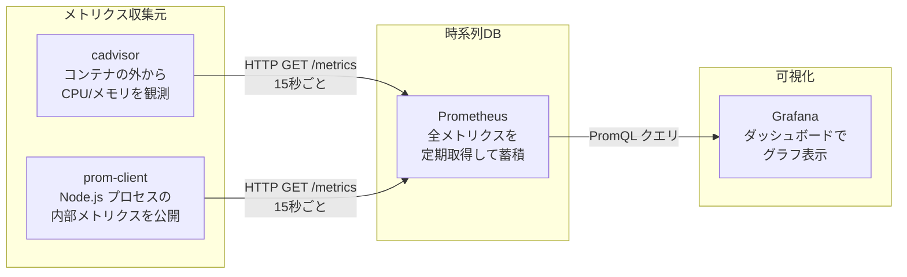

# yjs-server メトリクス監視 概要

## アーキテクチャ

```
cadvisor ──── /metrics ────┐
                           ├──→ Prometheus（時系列DB）──→ Grafana（ダッシュボード）
prom-client ── /metrics ───┘
               (yjs-server :9091)
```



## 各サービスの責務

### 1. cadvisor — コンテナ監視エージェント（収集元）

- Docker デーモンから全コンテナの CPU / メモリ / ネットワーク等を読み取り、`/metrics` エンドポイントで公開する
- 自分ではデータを保存しない（リアルタイムの値を返すだけ）
- ポート: `8080`

### 2. Prometheus — 時系列データベース（蓄積 + クエリ）

- 設定された対象（cadvisor, prom-client 等）に 15 秒ごとに HTTP GET してメトリクスを時系列で蓄積する
- この「取りに行く」動作を **スクレイプ（scrape）** と呼ぶ
- PromQL というクエリ言語で蓄積データを検索できる
- ポート: `9090`
- 設定ファイル: `docker/prometheus/prometheus.yml`

### 3. Grafana — 可視化ダッシュボード

- Prometheus に PromQL クエリを投げて、結果をグラフ表示する Web アプリ
- cadvisor と直接通信するのではなく、Prometheus 経由でデータを取得する
- ポート: `3001`（コンテナ内部は `3000`）
- 初期ログイン: `admin` / `admin`

### 4. prom-client — Node.js 用メトリクス公開ライブラリ（収集元）

- yjs-server 内で動作し、ヒープ / GC / CPU 等の Node.js 内部メトリクスを `/metrics` エンドポイントで公開する
- Prometheus が直接スクレイプする（cadvisor を経由しない）
- ポート: `9091`（`METRICS_PORT` 環境変数で変更可能）

### cadvisor と prom-client の違い

| 収集元 | 観測方法 | 取得できるもの |
|---|---|---|
| cadvisor | コンテナの**外**から Docker API 経由 | コンテナ全体の CPU / メモリ / ネットワーク |
| prom-client | プロセスの**中**から Node.js API 経由 | V8 ヒープ / GC / イベントループ遅延 |

## prom-client が自動収集するメトリクス

`collectDefaultMetrics()` により以下が自動的に `/metrics` で公開される:

| メトリクス名 | 内容 |
|---|---|
| `process_cpu_seconds_total` | プロセス CPU 使用時間（秒） |
| `process_cpu_user_seconds_total` | ユーザ空間 CPU 時間 |
| `process_cpu_system_seconds_total` | カーネル空間 CPU 時間 |
| `process_resident_memory_bytes` | RSS（実メモリ使用量） |
| `process_virtual_memory_bytes` | 仮想メモリサイズ |
| `nodejs_heap_size_total_bytes` | V8 ヒープ合計サイズ |
| `nodejs_heap_size_used_bytes` | V8 ヒープ使用量 |
| `nodejs_external_memory_bytes` | V8 外部メモリ |
| `nodejs_heap_space_size_used_bytes` | ヒープスペース別使用量 |
| `nodejs_gc_duration_seconds` | GC 停止時間（ヒストグラム、種別ごと） |
| `nodejs_eventloop_lag_seconds` | イベントループ遅延（平均） |
| `nodejs_eventloop_lag_p50_seconds` | イベントループ遅延（p50） |
| `nodejs_eventloop_lag_p99_seconds` | イベントループ遅延（p99） |
| `nodejs_active_handles_total` | アクティブハンドル数 |
| `nodejs_active_requests_total` | アクティブリクエスト数 |

## 関連ファイル

| ファイル | 役割 |
|---|---|
| `apps/yjs-server/src/yjs/metrics.ts` | prom-client の Registry 作成 + メトリクス HTTP サーバー |
| `apps/yjs-server/src/index.ts` | メトリクスサーバー起動 |
| `docker/prometheus/prometheus.yml` | Prometheus スクレイプ設定 |
| `docker/grafana/provisioning/datasources/prometheus.yml` | Grafana datasource 自動設定 |
| `docker/grafana/provisioning/dashboards/dashboards.yml` | Grafana dashboard provider 設定 |
| `docker/grafana/dashboards/yjs-server.json` | Grafana ダッシュボード定義 |
| `docker-compose.yml` | cadvisor / Prometheus / Grafana サービス定義 |
| `docker-compose.app.yml` | yjs-server のメトリクスポート公開 |

## Grafana ダッシュボード パネル構成

| パネル | データソース | 主な PromQL |
|---|---|---|
| Container CPU Usage | cadvisor | `rate(container_cpu_usage_seconds_total{name="kd1-yjs-server"}[1m])` |
| Node.js Process CPU | prom-client | `rate(process_cpu_seconds_total{job="yjs-server"}[1m])` |
| Container Memory | cadvisor | `container_memory_usage_bytes{name="kd1-yjs-server"}` |
| Process Resident Memory | prom-client | `process_resident_memory_bytes{job="yjs-server"}` |
| Node.js Heap | prom-client | `nodejs_heap_size_used_bytes` / `nodejs_heap_size_total_bytes` |
| Heap Spaces | prom-client | `nodejs_heap_space_size_used_bytes` |
| GC Duration | prom-client | `rate(nodejs_gc_duration_seconds_sum[1m])` |
| GC Pause Count | prom-client | `rate(nodejs_gc_duration_seconds_count[1m])` |
| Event Loop Lag | prom-client | `nodejs_eventloop_lag_seconds` / `p50` / `p99` |
| Active Handles / Requests | prom-client | `nodejs_active_handles_total` / `nodejs_active_requests_total` |

## 動作確認手順

```bash
# 1. 全サービス起動
docker compose -f docker-compose.yml -f docker-compose.app.yml up -d --build

# 2. prom-client メトリクス確認
curl http://localhost:9091/metrics

# 3. Prometheus targets 確認（ブラウザ）
# http://localhost:9090/targets
# → yjs-server が UP であること

# 4. Grafana ダッシュボード確認（ブラウザ）
# http://localhost:3001 （admin / admin）
# → KD1 フォルダ → yjs-server ダッシュボード
```
