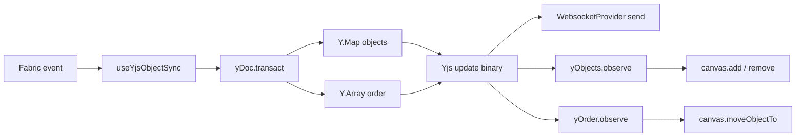

# useYjsObjectSync の z-order 同期化（Y.Array 追加）

## 設計方針

- **2 層モデル**
  - `Y.Map("objects")`: 属性（fabricSnapshot）の真実 — 既存のまま
  - `Y.Array<string>("order")`: yjsId の並びの真実 — 新規追加（末尾 = 前面、先頭 = 背面）
- **不変条件**: `yObjects` のキー集合 ＝ `yOrder` の要素集合（重複なし）
- 書き込みは必ず 1 つの `yDoc.transact(..., LOCAL_EDIT_ORIGIN)` にまとめる
- `yObjects.observe` は「存在管理」、`yOrder.observe` は「順序のみ」と責務分離

## 全体フロー



## 変更対象ファイル

- [apps/client/src/features/canvas-yjs/hooks/useYjsObjectSync.ts](apps/client/src/features/canvas-yjs/hooks/useYjsObjectSync.ts) のみ

## 変更ポイント（具体）

### 1. yOrder の取得追加（85 行目周辺）

```ts
const yObjects = yDoc.getMap<ObjectYjsEntry>("objects");
const yOrder = yDoc.getArray<string>("order");
```

### 2. 既存 Doc のマイグレーション（yOrder の遅延初期化）

`useEffect` 初頭で 1 度だけ実行する補正。
既存 canvas（`yObjects` だけがある）でも壊れないように。

```ts
if (yObjects.size > 0 && yOrder.length === 0) {
  yDoc.transact(() => {
    yOrder.push(Array.from(yObjects.keys()));
  }, LOCAL_EDIT_ORIGIN);
}
```

- **採用根拠**: 多クライアント同時参加でも `yOrder.length === 0` の判定は CRDT 的に決定論。同時実行されても重複は `transact` 内で抑止される（先勝ちの直後はもう 0 ではない）。**完全なリーダー選出は今回はやらず**、簡易方式を採用。

### 3. handleObjectAdded の修正（97-107 行目）

`yObjects.set` と一緒に `yOrder.push` する。

```ts
const handleObjectAdded = (e: { target?: FabricObject }) => {
  if (isApplyingRemote(depthRef)) return;
  const target = e.target;
  if (!target) return;
  const id = getObjectId(target);
  if (yObjects.has(id)) return;
  yDoc.transact(() => {
    yObjects.set(id, fabricToYjs(target));
    yOrder.push([id]);
  }, LOCAL_EDIT_ORIGIN);
};
```

### 4. handleObjectRemoved の修正（109-119 行目）

`yObjects.delete` と一緒に `yOrder` から該当 id を取り除く。

```ts
const handleObjectRemoved = (e: { target?: FabricObject }) => {
  if (isApplyingRemote(depthRef)) return;
  const target = e.target;
  if (!target) return;
  const id = getObjectId(target);
  if (!yObjects.has(id)) return;
  yDoc.transact(() => {
    yObjects.delete(id);
    const idx = yOrder.toArray().indexOf(id);
    if (idx >= 0) yOrder.delete(idx, 1);
  }, LOCAL_EDIT_ORIGIN);
};
```

### 5. handleObjectModified は変更なし（87-95 行目）

属性更新のみで並びは変えない（無駄な `yOrder` 更新を避ける）。

### 6. yObjects.observe の「add」処理 — 軽微な調整（124-149 行目）

末尾追加のままで OK。直後に `yOrder.observe` が発火して正しい index へ `moveObjectTo` する。
ただし「`yObjects` に add は来たが `yOrder` にまだ無い」など瞬間的不整合に備え、**末尾 add で問題なし**とする方針（後続の order 反映で揃う）。
既存ロジックほぼ維持。

### 7. yOrder.observe を新規追加

並びの真実を Fabric に反映する責務。

```ts
const orderObserver = (_event: Y.YArrayEvent<string>) => {
  const c = fabricRef.current?.getCanvas();
  if (!c) return;
  const ids = yOrder.toArray();
  depthRef.current += 1;
  try {
    ids.forEach((id, index) => {
      const obj = findFabricObjectById(c, id);
      if (obj) c.moveObjectTo(obj, index);
    });
    c.requestRenderAll();
  } finally {
    depthRef.current -= 1;
  }
};
yOrder.observe(orderObserver);
```

- ローカル発の transact でも observe は通知される性質に対応するため、`depthRef` でガード。
- Fabric v6 系の `canvas.moveObjectTo(obj, index)` を使用（**推測**: v6 採用前提）。利用不可だった場合は `canvas._objects` を直接並び替えて `requestRenderAll` する代替に切り替える。

### 8. renderYjsObjectsToCanvas の差し替え（211-236 行目）

`yOrder` を真実として **直列に** add する。順序保証 + 描画 race を解消。

```ts
async function renderYjsObjectsToCanvas(
  canvas: Canvas,
  yObjects: Y.Map<ObjectYjsEntry>,
  yOrder: Y.Array<string>,
  fabricRef: React.RefObject<FabricCanvasHandle | null>,
  depthRef: React.MutableRefObject<number>,
): Promise<void> {
  const ids = yOrder.length > 0
    ? yOrder.toArray()
    : Array.from(yObjects.keys()); // フォールバック
  if (ids.length === 0) return;
  for (const key of ids) {
    if (findFabricObjectById(canvas, key)) continue;
    const entry = yObjects.get(key);
    if (!entry) continue;
    depthRef.current += 1;
    try {
      const obj = await snapshotToFabricObject(entry.fabricSnapshot);
      const c = fabricRef.current?.getCanvas();
      if (!obj || !c) continue;
      setObjectId(obj, key);
      c.add(obj);
    } catch (err) {
      console.warn("[useYjsObjectSync] initial render failed", err);
    } finally {
      depthRef.current -= 1;
    }
  }
  fabricRef.current?.getCanvas()?.requestRenderAll();
}
```

- 呼び出し側は `void renderYjsObjectsToCanvas(...)` のまま。
- enliven の I/O 待ちを直列化することで初期 z-order が安定する。

### 9. クリーンアップ追加（202-207 行目）

```ts
return () => {
  canvas.off("object:modified", handleObjectModified);
  canvas.off("object:added", handleObjectAdded);
  canvas.off("object:removed", handleObjectRemoved);
  yObjects.unobserve(observer);
  yOrder.unobserve(orderObserver);
};
```

## 関心の分離（自己レビュー）

- SRP: hook は「Fabric ↔ Y.Map ↔ Y.Array の同期」のみ。並べ替えボタンの実装は本変更のスコープ外（後日 `features/canvas-yjs/hooks/useZOrder.ts` 等で追加）。
- OCP: bringToFront / sendToBack 等は **`yOrder` を transact で操作するだけ**で hook 側の追加実装不要（差し込みやすい）。
- DIP: UI/I/O への依存は増えていない。Yjs の共有型に閉じている。

## スコープ外（今回はやらない）

- 並べ替えボタン UI とハンドラ（`bringToFront` 等）の追加
- `apps/yjs-server` の永続化コード（`expandCanvasToYDoc` 等）の `order` 対応 — **要件次第。MongoDB から復元する際に順序を保ちたい場合は別途必要**（要追加タスク化）
- Awareness を使ったマイグレーション・リーダー選出（簡易方式で十分と判断）

## 動作確認手順（実装後）

1. `apps/client` を起動し、新規 canvas で図形を 5 つ作成 → リロード後、生成順（= 末尾が前面）が再現するか
2. 別タブで同じ canvas を開き、片方で図形を追加削除 → 他方の z-order が一致するか
3. 図形をドラッグ移動 → `yOrder` は変わらず、`yObjects` のみ更新される（DevTools で `yDoc.getArray("order").toArray()` を観測）
4. 既存の `Y.Map("objects")` だけのドキュメントを開いて、初回ロード時に `yOrder` が `yObjects.keys()` の内容で初期化されるか

## 不明点 / 推測

- Fabric v6 の `canvas.moveObjectTo(obj, index)` 利用可能性は要動作確認（推測）。
- `useYjsUndoManager` が `LOCAL_EDIT_ORIGIN` を `trackedOrigins` に持っていれば、yOrder 操作も自動的に Undo 対象になる（既存の useYjsUndoManager.ts:44 行目 `trackedOrigins: new Set([LOCAL_EDIT_ORIGIN])` から推測 — 期待通り動作する見込み）。
